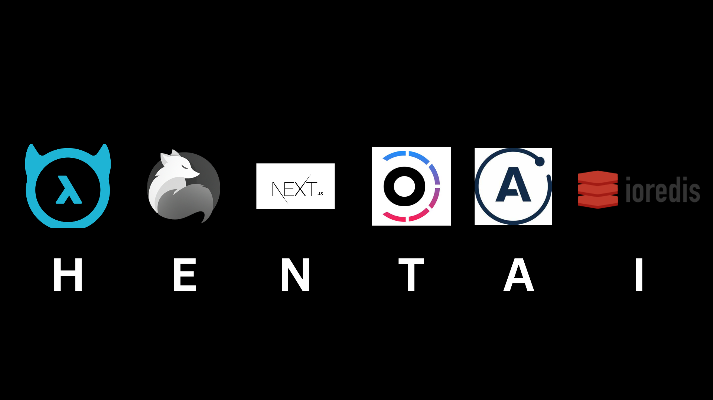

# !WARNING

**WIP** and most of this README is AI generated, I will edit it when I get an application running.

# 💬 HENTAI Stack

A modern monorepo application using the **HENTAI** stack:

- **H** – Hasura (GraphQL engine for real-time subscriptions)
- **E** – Elysia.js (Type-safe, fast backend for auth and business logic)
- **N** – Next.js (React framework for the frontend)
- **T** – Turborepo (High-performance monorepo orchestration)
- **A** – Apollo Client (Frontend GraphQL queries & subscriptions)
- **I** – Integration of all above into a fast, scalable system

## 🧙‍♂️ HENTAI Stack Motto



> _"High-performance, Extensible, Non-blocking, Typed, Apollo-powered, Integrated."_  
> The only stack with a naughty name and a clean architecture.


---

## 🧱 Monorepo Structure

```
apps/
  web/        # Shadcn + Next.js frontend (React)
  api/        # Elysia.js backend (auth, side logic)
  hasura/       # Hasura GraphQL engine (DB + subscriptions)

packages/
  ui/         # Shared Shadcn components
  config/     # Shared TypeScript, Tailwind, Eslint configs

.turbo/
  # Turborepo caching & pipeline settings
```

---

## 🚀 Getting Started

### 1. Clone the Monorepo

```bash
git clone https://github.com/rekka69/HENTAI-starter-template.git
cd hentai-starter
```

### 2. Install Dependencies

```bash
bun install
```

### 3. Set Up Hasura

- Connect Hasura to a PostgreSQL database (local or remote).
- Import the schema from `/hasura/metadata/` or run migrations.
- Configure environment variables:

```bash
cp .env.example .env
# Add your HASURA_GRAPHQL_ENDPOINT, JWT_SECRET, etc.
```

Start Hasura locally (Docker):

```bash
cd hasura
docker-compose up -d
```

### 4. Start the Dev Servers

```bash
# Run everything in parallel
bun dev
```

Or run each individually:

```bash
bun --filter=api dev
bun --filter=web dev
bun --filter=hasura dev
```

---

## 💡 Features

### ✅ Shadcn + Next.js (Frontend)
- Modern UI
- Subscriptions for live updates via Apollo
- Shared UI components from `packages/ui`

### ✅ Elysia.js (API Layer)
- [ ] JWT Auth
- REST endpoints for business logic not handled by Hasura
- Typed routes & ultra-low-latency

### ✅ Hasura (GraphQL Subscriptions)
- Auto-generated queries/mutations/subscriptions
- Role-based permissions
- Realtime messaging

### ✅ Apollo Client
- Live data via GraphQL subscriptions
- Local cache management
- Type-safe hooks via GraphQL Codegen

### ✅ Turborepo
- Efficient build & dev pipelines
- Shared packages & caching
- Incremental deployments

---

### ⚡ Realtime Layer with Redis (ioredis)

We use **[ioredis](https://github.com/luin/ioredis)** for:

- Pub/Sub messaging (e.g. bridging Elysia and Hasura)
- Session or rate-limit caching
- Decoupled event broadcasting

```ts
// Elysia API example
import Redis from 'ioredis'

const redis = new Redis()

redis.subscribe('new_message')
redis.on('message', (channel, message) => {
  console.log(`New message on ${channel}: ${message}`)
})
```

You can emit events from Elysia routes, background jobs, or even sync Redis with Hasura metadata for caching complex queries.

---

## 🧪 Database Schema (PostgreSQL)

```sql
-- users table
CREATE TABLE users (
  id SERIAL PRIMARY KEY,
  name TEXT NOT NULL
);

-- messages table
CREATE TABLE messages (
  id SERIAL PRIMARY KEY,
  user_id INTEGER REFERENCES users(id),
  content TEXT NOT NULL,
  created_at TIMESTAMPTZ DEFAULT now()
);
```

---

## 🔐 Authentication Flow

1. User logs in via Elysia endpoint (`/api/auth`)
2. Elysia issues JWT
3. JWT passed in headers to Hasura via `Authorization: Bearer <token>`
4. Hasura uses JWT to enforce role-based permissions

---

## 📦 Technologies

| Layer         | Tech                           |
|---------------|--------------------------------|
| Monorepo      | TurboRepo                      |
| Frontend      | Next.js + Shadcn UI + Apollo   |
| API / Auth    | Elysia.js                      |
| Realtime Layer| ioredis (Pub/Sub, Cache)       |
| Database API  | Hasura                         |
| GraphQL Client| Apollo Client                  |
| DB            | PostgreSQL                     |

---

## 🛠️ Commands

| Command                   | Description                              |
|-------------------------- |------------------------------------------|
| `bun turbo dev`           | Run all apps in dev mode (via Turbo)     |
| `bun build`               | Build all apps                           |
| `bun lint`                | Lint all apps and packages               |
| `bun ui add <component>`  | Adds shadcn components                   |
| `bun --filter=web dev`    | Run the frontend                         |
| `bun --filter=api dev`    | Run the backend                          |
| `bun --filter=hasura dev` | Run the backend                          |

---

## 📄 License

MIT License.

---
---

## 👋 Contributing

Pull requests welcome. If you're interested in expanding the stack to include:
- Firebase for auth?
- tRPC or TanStack Query?
- WebRTC for voice/video?

Open an issue and let’s collaborate!
